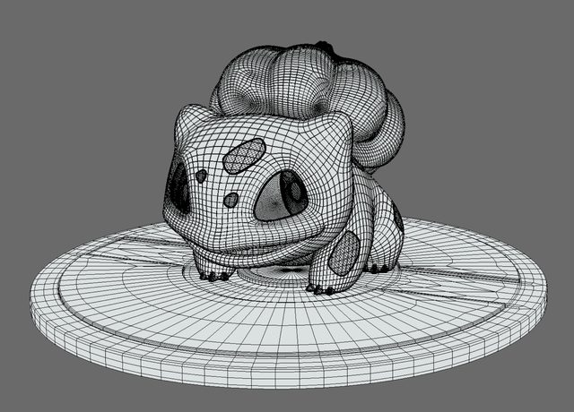
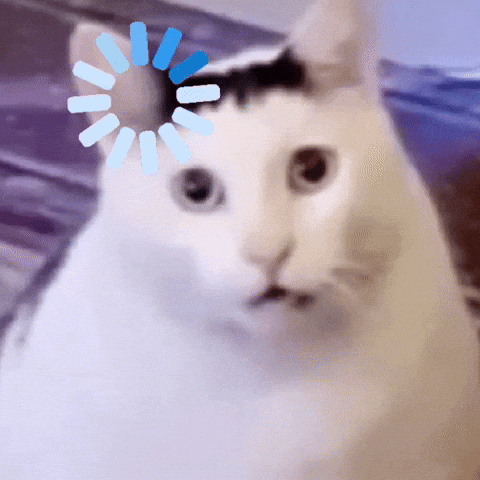

# Assignment0

**AndrewId**: sbandred
**Name:** Sri Datta Bandreddi

## Task 1: ChatGPT

**Prompt:**

> Write me a joke about 3d point mesh clouds

**ChatGPT's answer:**

> Why did the 3D point cloud get kicked out of the mesh party?
> It had no faces, no edges, and absolutely no connections.

## Task 2: 3D Shape Image

This is a **Bulbasaur** 3D model, a pokemon with 3D shape in a mesh geometry.

**Source:** [Bulbasaur on Sketchfab](https://sketchfab.com/3d-models/bulbasaur-5fa5d39c156a452ebb63e5b65305fad0)

## Task 3: Funny GIF

**Source:** [Lemme Think GIF on GIPHY](https://giphy.com/gifs/cats-memes-funny-cat-pY8jLmZw0ElqvVeRH4) by [@brown_giphy](https://giphy.com/brown_giphy)

