# 16-825 Assignment 1

## 1.1 Turntable render
Render the cow from all angles to make a spinning gif.

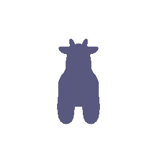

## 1.2 Dolly zoom
Change the field of view while moving the camera so the cow stays the same size.

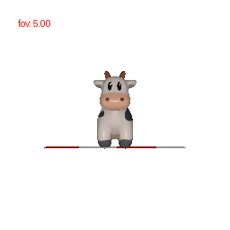

## 2.1 Tetrahedron
Build a tetrahedron by hand (4 vertices, 4 faces) and spin it.

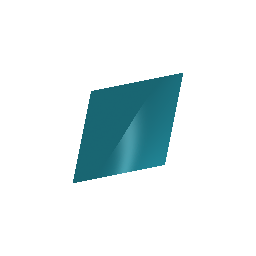

## 2.2 Cube
Build a cube by hand (8 vertices, 12 triangle faces) and spin it.

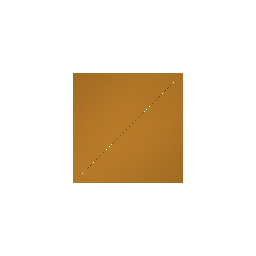

## 3. Retexturing
Color the cow from front to back, blending blue at the front into red at the back.

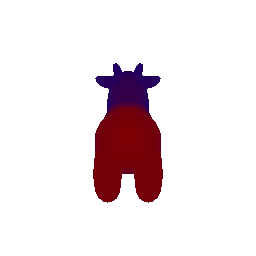

## 4. Camera transformations
Find the camera moves that reproduce each target view.

**Rotate in the image plane**
```
R_relative = [ 0  1  0 ]    T_relative = [0, 0, 0]
             [-1  0  0 ]
             [ 0  0  1 ]
```

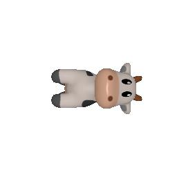

**View from the side**
```
R_relative = [ 0  0  1 ]    T_relative = [-3, 0, 3]
             [ 0  1  0 ]
             [-1  0  0 ]
```

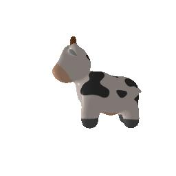

**Move the camera back so the cow looks smaller**
```
R_relative = [ 1  0  0 ]    T_relative = [0, 0, 3]
             [ 0  1  0 ]
             [ 0  0  1 ]
```

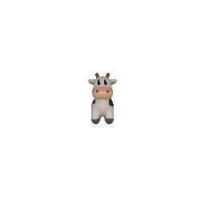

**Shift the cow left and down**
```
R_relative = [ 1  0  0 ]    T_relative = [0.4, -0.4, 0]
             [ 0  1  0 ]
             [ 0  0  1 ]
```

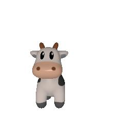

## 5.1 Point clouds from RGBD
Turn two color plus depth images into 3D point clouds and view each one plus their union.

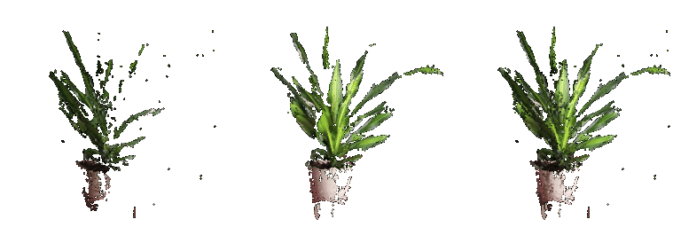

## 5.2 Parametric point clouds
Sample a torus and a hyperboloid from their parametric equations as point clouds.

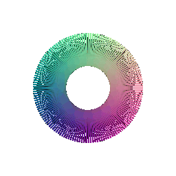
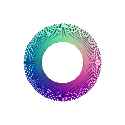

## 5.3 Implicit surfaces
Turn implicit equations into meshes (marching cubes): a torus (hole visible) and a hollow cube frame.


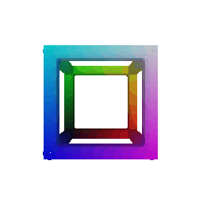

**Mesh vs. point cloud:**
I look at the tradeoff to be something between connectivity and smoothness. A mesh size definitely depends on the size we choose, it is often coarse and takes a long time to render if a sharper resolution is chosen, it has the connectivity data. If someone is prioritizing for connectivity data, mesh would make more sense. Point clouds are able to give an idea of the shape and smoothness quicker based on the sampling, as the points don't need to store connectivity, the surface and connectivity data might not be there, at the same time for just looking at shape or representation, this would be much better.

## 6. Rainbow grid cow
Paint a grid of random colors onto the cow through its UV texture.

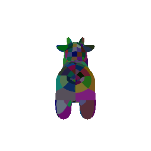

## 7. Sampling points on meshes
Uniformly sample the cow's surface and compare 10 / 100 / 1000 / 10000 points to the mesh.

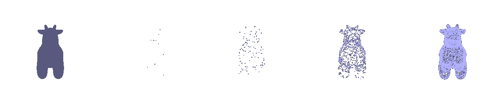
