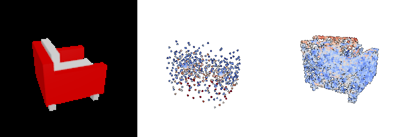
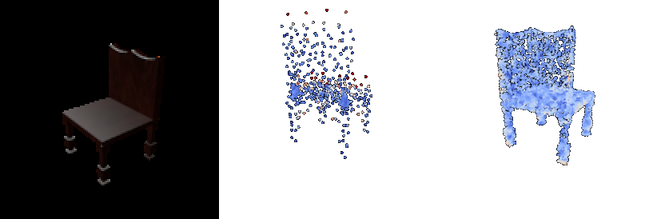
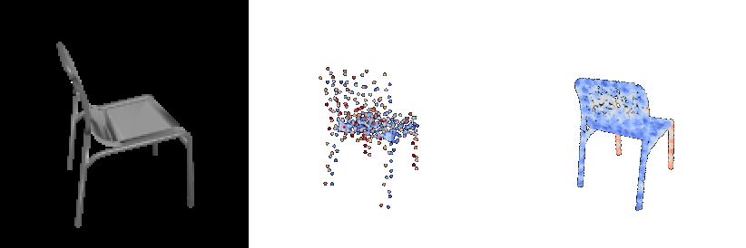

# 16-825 Assignment 2

**AndrewId**: sbandred

**Name:** Sri Datta Bandreddi

Trained on one H100 (PyTorch 2.14, PyTorch3D 0.7.9). The ResNet18 encoder is trained end to end from the images; `--load_feat` was not used.

## 1.1 Fitting a voxel grid
Optimize a random 32³ grid toward a target chair with binary cross-entropy on the occupancy logits (10k iterations). Left: fitted, right: target.


## 1.2 Fitting a point cloud
Optimize 5000 random points toward the target with a chamfer loss written from scratch: the squared distance from each point to its nearest neighbour in the other cloud, averaged in both directions (20k iterations). Left: fitted, right: target.


## 1.3 Fitting a mesh
Deform an ico-sphere toward the target with chamfer on 5000 sampled points plus 0.1 × Laplacian smoothing (10k iterations). Left: fitted, right: target. The sphere can't grow holes, so it stretches thin webs between the legs.


## 2. Single view to 3D: setup
ResNet18 (ImageNet weights) turns the image into a 512-d feature, and a decoder per representation turns that into 3D. Adam, lr 4e-4, batch 32, 8 data workers. Each model was trained to 10k steps, then resumed to 20k, and the better checkpoint is reported. The test set is 678 chairs with the view fixed by seed 21, so every model sees the same inputs. Each picture below is **input | prediction | ground-truth mesh**, for the same three test chairs.

## 2.1 Image to voxel grid
Decoder:
```
Linear 512→16384, ReLU                    → reshaped to 256×4×4×4
ConvTranspose3d 256→128, k4 s2, BN, ReLU  → 128×8×8×8
ConvTranspose3d 128→64,  k4 s2, BN, ReLU  → 64×16×16×16
ConvTranspose3d 64→32,   k4 s2, BN, ReLU  → 32×32×32×32
Conv3d 32→1, k3                           → 1×32×32×32 logits
```

**F1@0.05 = 70.3** (20k steps)


Thin chairs (last row) are the hard case. Only a few percent of voxels are filled, so "empty" is the cheap guess for thin parts. At 10k steps, 28 test chairs came out completely empty and F1 was 58.6; at 20k, none are empty, but thin metal frames are still fragments.

## 2.2 Image to point cloud
Decoder:
```
Linear 512→1024, ReLU
Linear 1024→1024, ReLU
Linear 1024→3000, tanh                    → reshaped to 1000×3 points
```

**F1@0.05 = 79.9** (10k steps)


## 2.3 Image to mesh
Decoder:
```
Linear 512→1024, ReLU
Linear 1024→1024, ReLU
Linear 1024→7686                          → reshaped to 2562×3 vertex offsets
```
The offsets move the vertices of a level-4 ico-sphere. Loss: chamfer on 1000 points + 0.1 × Laplacian smoothing.

**F1@0.05 = 73.2** (20k steps)


**Comparison:**

| Representation | F1@0.05 at 10k steps | F1@0.05 at 20k steps |
|---|---|---|
| Point cloud | **79.9** | 79.0 |
| Mesh | 71.1 | **73.2** |
| Voxel grid | 58.6 | **70.3** |

Point clouds score highest because they're trained on almost exactly what F1 measures: every point moves freely and chamfer pulls it onto the surface. Nothing ties the points together, which is why the clouds bunch up at the seat and back, where most of the surface is, and leave the legs sparse. Meshes use the same loss, but every vertex is tied to the sphere, so they can't open holes between legs, and vertices pulled toward thin parts turn into spikes. Voxels are limited by resolution (one voxel is about 0.03, close to the 0.05 threshold), by thin parts disappearing, and by the marching-cubes step before scoring. Going from 10k to 20k steps helped voxels and meshes a lot, but the point model started to overfit, so its 10k checkpoint is kept. Choosing checkpoints by test F1 is a mild form of test-set selection; a validation split would be the cleaner way.

## 2.4 Effects of hyperparameters
Vary the mesh smoothness weight `w_smooth` (the Laplacian term in the mesh loss): 0.1, 1 and 5, everything else the same, 10k steps each. Columns: **input | w_smooth 0.1 | w_smooth 1 | w_smooth 5 | ground truth**.


| w_smooth | F1@0.05 |
|---|---|
| 0.1 | **71.1** |
| 1 | 67.8 |
| 5 | 60.2 |

It's a straight trade between looking right and scoring well. At 0.1 the meshes reach for the legs and thin parts, but the vertices that get pulled there leave spikes and folds behind. At 1 most of the spikes are gone and leg-like shapes start to form. At 5 the surface is clean, but the smoothness term wins over chamfer: neighbouring vertices aren't allowed to separate, so the four legs merge into one tent shape and the seat and back blend into a single curved sheet. F1 only checks whether points land near the surface, so it rewards the spiky version that covers more of the chair and drops 11 points for the clean one. For a mesh you'd actually use, something around 1 is the better choice; for the metric, the lowest weight wins.

## 2.5 Interpreting the model
Where does the point-cloud model go wrong? Each picture is **input | predicted points | ground-truth surface**. A predicted point is coloured by its distance to the true surface, and a surface point by its distance to the nearest prediction (blue = right on it, red = 0.1 away or more). Red on the right means part of the chair was missed.





The same distances over all 678 test chairs, split into ten bands by height (0 = floor, 1 = top of the chair):


The model gets the middle of the chair right and misses the ends. About 86% of the surface between heights 0.3 and 0.7 is covered, but only 62% at floor level (the feet) and 68% at the top of the back. The right plot shows why: 74% of the predicted points sit in the 0.3–0.7 band, where only 57% of the surface is, and the lowest band gets 2.9% of the points for 7.0% of the surface. The seat looks roughly the same in every chair, so putting points there is a safe bet under chamfer loss. Legs and backrest tops change a lot from chair to chair, so the model hedges with a few scattered points instead of committing to a shape.

## 3.1 Implicit network
Instead of decoding the whole grid at once, an MLP answers one question at a time: given the image feature and a 3D point, is this point inside the chair? Querying it at every point of a 32³ grid over (-1, 1)³ gives an occupancy grid, which is trained with the same BCE loss and evaluated the same way as the voxel model in 2.1.
```
input: 512-d image feature concatenated with (x, y, z)   → 515
Linear 515→512, ReLU
Linear 512→512, ReLU
Linear 512→512, ReLU
Linear 512→1                                              → occupancy logit for that point
queried at all 32×32×32 grid points                       → 1×32×32×32 logits
```
Trained exactly like the voxel model: 10k steps, then resumed to 20k. Columns: **input | voxel decoder (2.1) | implicit decoder | ground truth**, both at 20k steps.


| Decoder | F1@0.05 at 10k | F1@0.05 at 20k | Empty predictions at 20k | Decoder size |
|---|---|---|---|---|
| Voxel (3D conv) | 58.6 | **70.3** | 0 | 11.2M |
| Implicit (MLP) | 41.6 | 47.8 | 80 / 678 | 0.8M |


The implicit decoder is much worse here, and the pictures show why: it makes smooth, rounded shapes and drops thin parts. The armchair, which is mostly big flat panels, comes out close to the voxel version, but the chair in the middle keeps only its backrest, the one on the bottom becomes a single slab, and 80 test chairs (including #100 from the earlier sections) come out empty. A plain MLP fed raw (x, y, z) coordinates is known to learn smooth, low-detail functions first, so the sharp jump from "inside" to "outside" across a thin leg is the hardest thing for it to represent. The voxel decoder doesn't have this problem because each 3D conv layer works locally and directly outputs a grid. Training longer helps (41.6 → 47.8) but slowly. The usual fixes would be a positional encoding of (x, y, z) (as in NeRF) or conditioning on local image features instead of one global vector (as in PIFu). The one advantage of the implicit decoder is size: it's 14× smaller than the voxel decoder and can be queried at any resolution, not just 32³.
