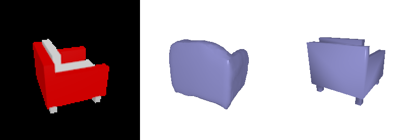
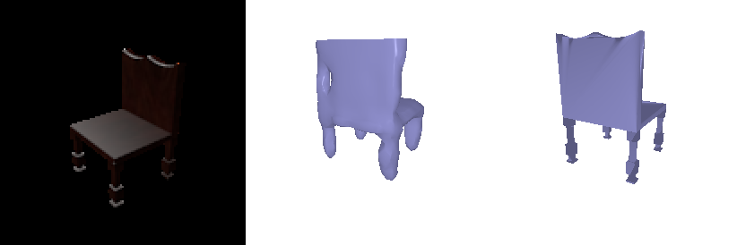
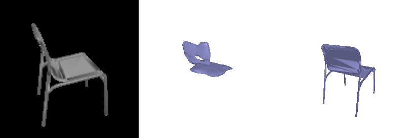
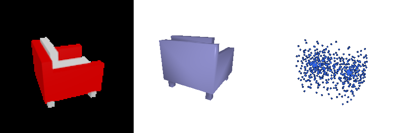
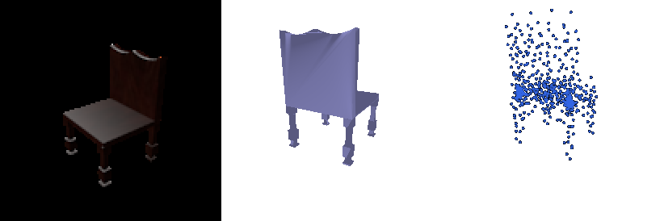
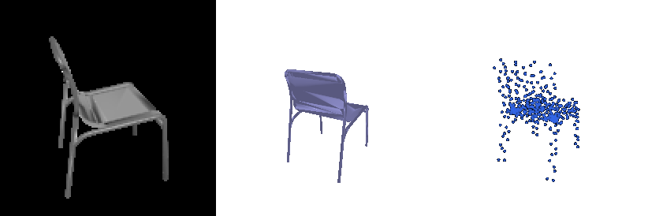
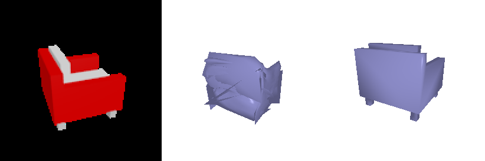
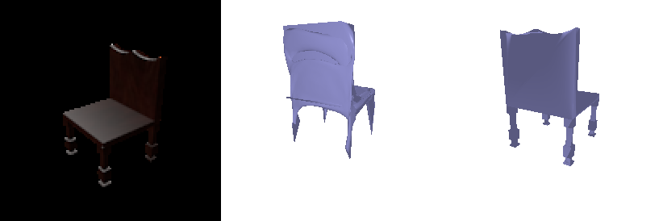
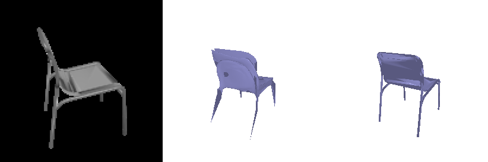

# 16-825 Assignment 2: Single View to 3D

**AndrewId**: sbandred

**Name:** Sri Datta Bandreddi

All training and evaluation ran on one H100 (PyTorch 2.14 / CUDA 13.0, PyTorch3D 0.7.9 built from source).
The image encoder (ResNet18) is trained end to end from the raw images; **`--load_feat` was not used**.

## 1. Exploring loss functions

Each fit starts from a random voxel grid / random point cloud / level-4 ico-sphere and optimizes it directly
against one chair from the training set (Adam, lr 4e-4). In every gif the **fitted result is on the left and the target on the right**.

### 1.1 Fitting a voxel grid

Binary cross-entropy on occupancy logits (`F.binary_cross_entropy_with_logits`); the grid is shown after a sigmoid,
meshed with marching cubes at 0.5. 10k iterations, final loss 0.067.

### 1.2 Fitting a point cloud

Chamfer loss written from scratch: for each point the squared distance to its nearest neighbour in the other cloud
(`knn_points`), averaged, in both directions. 5000 points, 20k iterations.

### 1.3 Fitting a mesh

Chamfer on 5000 points sampled from both surfaces + 0.1 × uniform Laplacian smoothing, 10k iterations.
The sphere cannot change genus, so it stretches thin webs between the legs instead of opening holes.

## 2. Reconstructing 3D from single view

Shared setup: ResNet18 (ImageNet weights) encodes the image to a 512-d feature; a decoder per representation.
Adam, lr 4e-4, batch 32. Each model was trained for 10k steps (~52 epochs over the 6100 training chairs, one random
view each time), then resumed to 20k steps; the better of the two checkpoints is reported (see the table at the end of 2.3).
Evaluation is over the 678 test chairs with the test view fixed by `seed 21`, so all three models see identical inputs.

Each row below: **input RGB | prediction | ground-truth mesh**, for the same three test chairs (#0, #400, #100).

### 2.1 Image to voxel grid

Decoder: linear 512 → 256×4³, then three `ConvTranspose3d` + BatchNorm + ReLU blocks (4³ → 8³ → 16³ → 32³) and a
final 3³ conv to one logit per voxel. Trained with the BCE loss from 1.1.

**F1@0.05 = 70.3** (20k steps)

The last row is the typical failure: thin-framed chairs. Only a few percent of voxels are occupied, so for thin parts
"empty" is the cheaper guess under BCE. At 10k steps this was severe: 28 of 678 test chairs had no voxel above 0.5
(no surface for marching cubes, scored F1 = 0) and F1 was 58.6. Training to 20k removed every empty prediction and
added legs on chairs like the second row, but thin metal frames still come out as fragments.

### 2.2 Image to point cloud

Decoder: MLP 512 → 1024 → 1024 → 1000×3 with `tanh` on the output. Trained with the chamfer loss from 1.2
against 1000 points sampled from the GT mesh.

**F1@0.05 = 79.9** (10k steps)

### 2.3 Image to mesh

Decoder: MLP 512 → 1024 → 1024 → 2562×3, predicting a per-vertex offset for a level-4 ico-sphere.
Loss: chamfer (1000 points) + 0.1 × Laplacian smoothing.

**F1@0.05 = 73.2** (20k steps)

**Comparison.**

| Representation | F1@0.05 at 10k steps | F1@0.05 at 20k steps |
|---|---|---|
| Point cloud | **79.9** | 79.0 |
| Mesh | 71.1 | **73.2** |
| Voxel grid (32³) | 58.6 | **70.3** |

Training loss kept falling for all three between 10k and 20k, but only voxels and meshes improved on the test set;
the point decoder (the least constrained output: its last layer alone has 3M weights) had started to overfit.
Note that picking the better checkpoint by test F1 is a mild form of test-set selection; with a held-out validation
split this choice would be made there instead.

- **Point clouds score highest** because the network is trained on almost exactly what F1 measures: each of the 1000
  points is free to move and the chamfer loss directly pulls points onto the surface. It pays nothing for structure,
  which is why the clouds look like a dense blob at the seat with sparse legs: the seat and back hold most of the surface area.
- **Meshes** optimize the same chamfer objective but every vertex is tied to a sphere's connectivity. They cannot open
  holes between legs or under the seat, and with a small smoothness weight the vertices that are pulled toward thin parts form spikes.
- **Voxels** are limited by resolution (one voxel is 1/32 of the box, close to the 0.05 threshold itself), by the
  class imbalance that makes thin parts disappear, and by the marching-cubes step between prediction and evaluation.

### 2.4 Analyse effects of hyperparameter variations

*In progress.*

### 2.5 Interpret your model

*In progress.*

## 3. Exploring other architectures / datasets

*In progress.*
