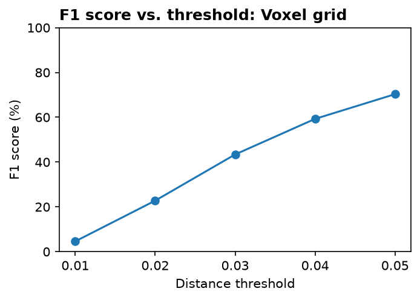
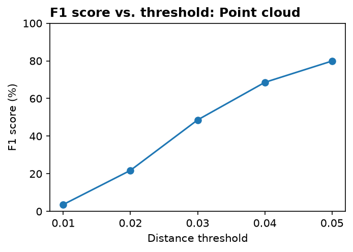
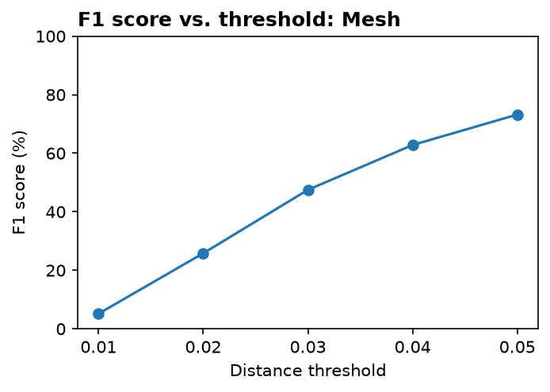
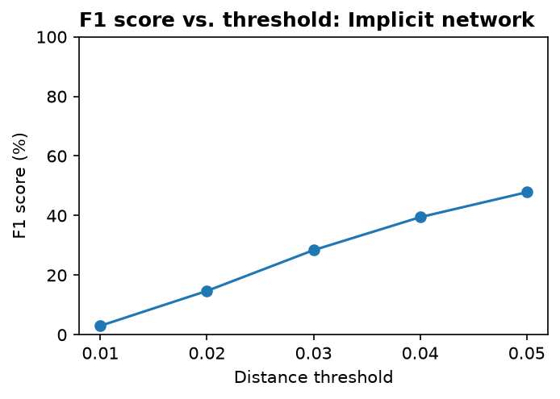
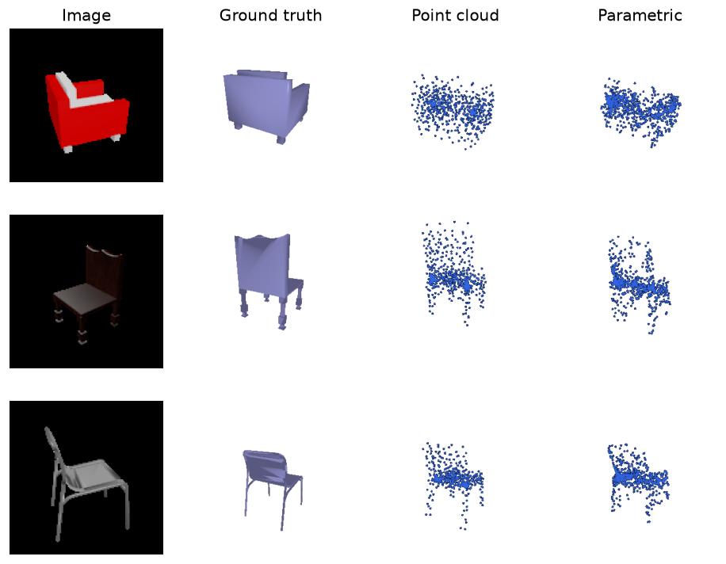
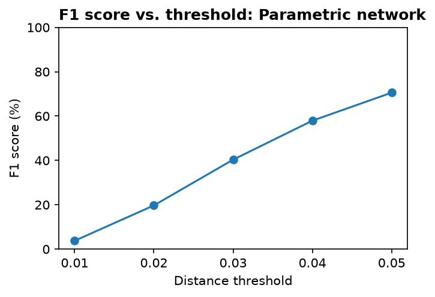
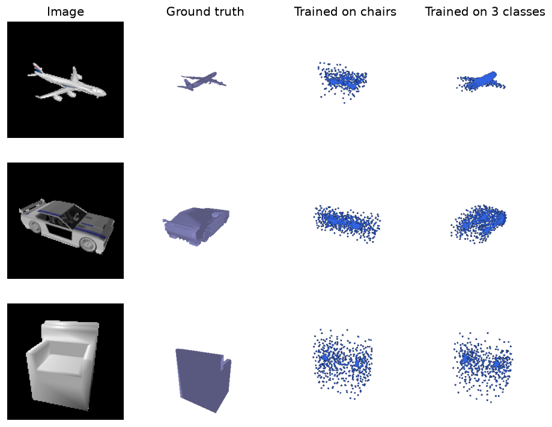

# 16-825 Assignment 2

**AndrewId**: sbandred

**Name:** Sri Datta Bandreddi

## 1.1 Fitting a voxel grid
Fit a random grid to a chair using binary cross-entropy.


## 1.2 Fitting a point cloud
Fit 5000 random points to a chair using chamfer loss.


## 1.3 Fitting a mesh
Deform a sphere into a chair using chamfer loss plus smoothing. A sphere can't make holes, so it stretches thin sheets between the legs.


## 2. Setup
A ResNet18 turns the image into 512 numbers, and a decoder turns those into a 3D shape. Adam, learning rate 4e-4, batch size 32. Each model was trained for 10k steps, then 20k, and the better one is shown. All models are tested on the same 678 chairs with the same views.

## 2.1 Image to voxel grid
```
Linear 512->16384, ReLU
ConvTranspose3d 256->128, k4 s2, BN, ReLU
ConvTranspose3d 128->64,  k4 s2, BN, ReLU
ConvTranspose3d 64->32,   k4 s2, BN, ReLU
Conv3d 32->1, k3
```

**F1@0.05 = 70.3**




Thin chairs (bottom row) are hard: most voxels are empty, so the model leaves thin parts out.

## 2.2 Image to point cloud
```
Linear 512->1024, ReLU
Linear 1024->1024, ReLU
Linear 1024->3000, tanh
```

**F1@0.05 = 79.9**




## 2.3 Image to mesh
```
Linear 512->1024, ReLU
Linear 1024->1024, ReLU
Linear 1024->7686
```
The offsets move the points of a sphere mesh.

**F1@0.05 = 73.2**




**Comparison:**

| Representation | F1 at 10k steps | F1 at 20k steps |
|---|---|---|
| Point cloud | **79.9** | 79.0 |
| Mesh | 71.1 | **73.2** |
| Voxel grid | 58.6 | **70.3** |

- **Points score best.** Each point can move anywhere, and the loss is close to what F1 measures.
- **Meshes come next.** They use the same loss, but a sphere can't make holes, so thin parts become spikes.
- **Voxels score lowest.** A 32^3 grid is coarse, and thin parts vanish.
- **Longer training** helped voxels and meshes, but the point model started to memorize the training chairs, so its 10k version is kept.

## 2.4 Effects of hyperparameters
Change the mesh smoothing weight `w_smooth` (10k steps each).


| w_smooth | F1@0.05 |
|---|---|
| 0.1 | **71.1** |
| 1 | 67.8 |
| 5 | 60.2 |

More smoothing gives cleaner meshes but a lower score. At 5, the legs merge into one tent shape. F1 only checks that points land near the surface, so the spiky meshes score higher.

## 2.5 Interpreting the model
Where does the point model go wrong? Each point is coloured by its distance to the nearest point of the other shape.


Recall and point distribution by height, over all 678 test chairs:


Recall is about 85% in the middle of the chair but drops to 62% at the feet and 68% at the top of the backrest. The model places 74% of its points in the seat region (height 0.3 to 0.7), which holds only 57% of the surface. Seats look alike across chairs, so this is a safe bet under chamfer loss; legs and backrests vary more, so the model spreads fewer points there.

## 3.1 Implicit network
An MLP takes the image features and one 3D point, and says whether the point is inside the chair. Asking it at every point of a 32^3 grid gives a voxel grid, trained and tested like 2.1.
```
image features (512) + point (x, y, z)
Linear 515->512, ReLU
Linear 512->512, ReLU
Linear 512->512, ReLU
Linear 512->1
```


| Decoder | F1 at 10k | F1 at 20k | Empty outputs (of 678) |
|---|---|---|---|
| Voxel (3D conv) | 58.6 | **70.3** | 0 |
| Implicit (MLP) | 41.6 | 47.8 | 80 |



The implicit model is much worse. It makes smooth blobs and loses thin parts like legs, and 80 chairs come out empty. A plain MLP on raw (x, y, z) has trouble with sharp detail; adding a positional encoding (as in NeRF) is the usual fix. Its one advantage is size: 14x smaller than the voxel decoder.

## 3.2 Parametric network
An MLP takes the image features and a random 2D point from a unit square, and outputs one 3D point. Asking it at 1000 random 2D points gives a point cloud, trained and tested like 2.2.
```
image features (512) + 2D point (u, v)
Linear 514->512, ReLU
Linear 512->512, ReLU
Linear 512->512, ReLU
Linear 512->3, tanh
```



| Decoder | F1@0.05 (10k steps) |
|---|---|
| Point cloud (2.2) | **79.9** |
| Parametric | 70.6 |



The parametric model is worse. It bends a flat sheet into the chair, so the sheet has to stretch between the seat, back and legs, and points land in the gaps. Its advantages are size (6x smaller than the point decoder) and that it can make any number of points.

## 3.3 Extended dataset
Train the point model from 2.2 on chairs, planes and cars (12,886 objects instead of 6,100), 10k steps. Both models are tested on the 3-class test set.



| Trained on | Chairs | Planes | Cars | All |
|---|---|---|---|---|
| Chairs only | 79.6 | 70.1 | 67.0 | 73.8 |
| 3 classes | **79.8** | **95.9** | **93.5** | **87.7** |

Chairs score the same, even though each chair is seen half as often. The chair-only model turns planes and cars into chair-like blobs, while the 3-class model gets their shape. Planes and cars score higher than chairs because their shapes vary less.
